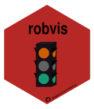
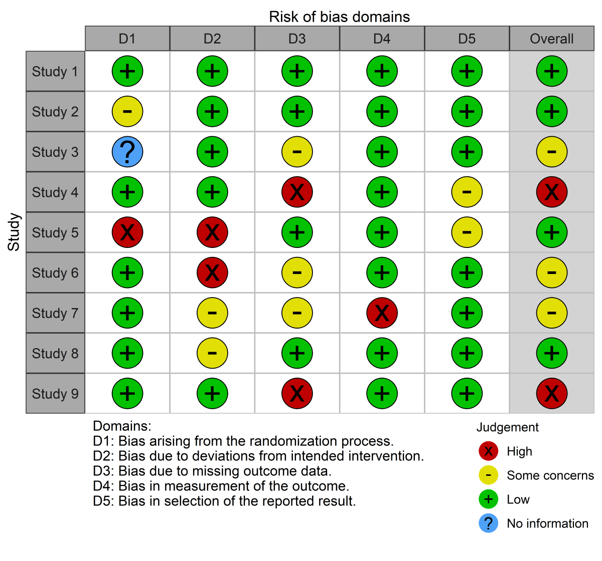
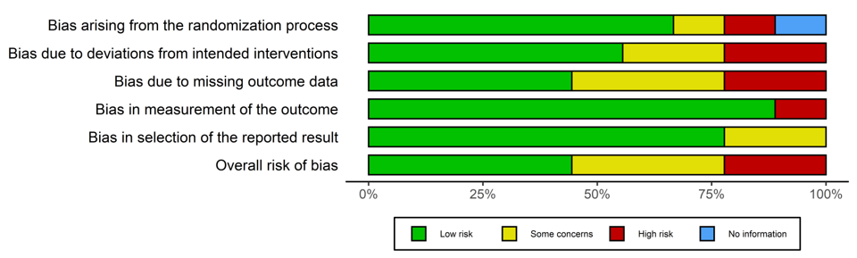
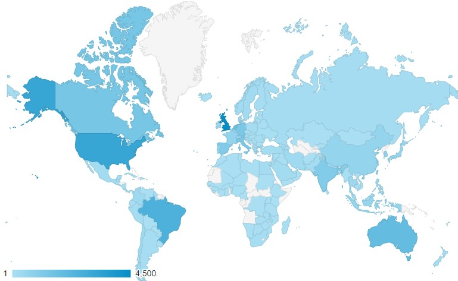
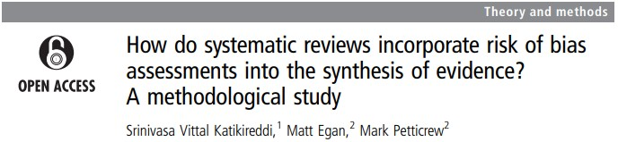
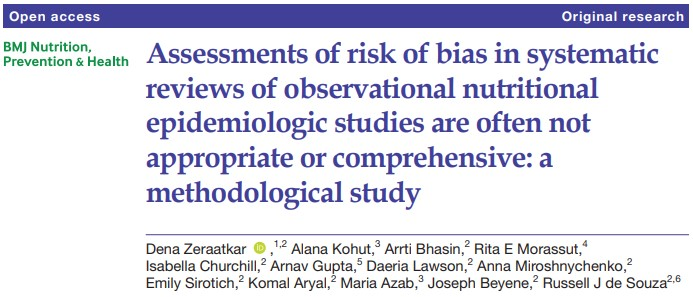
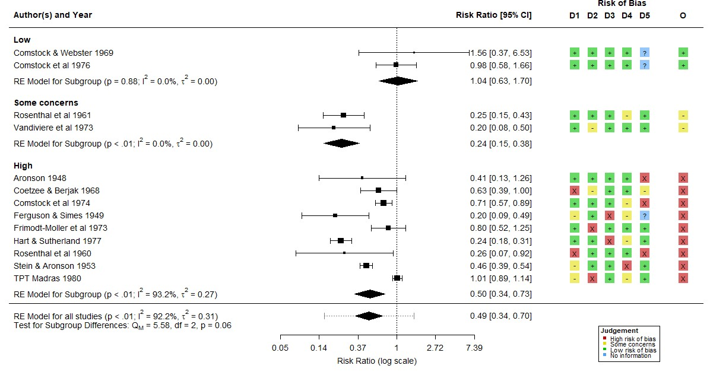
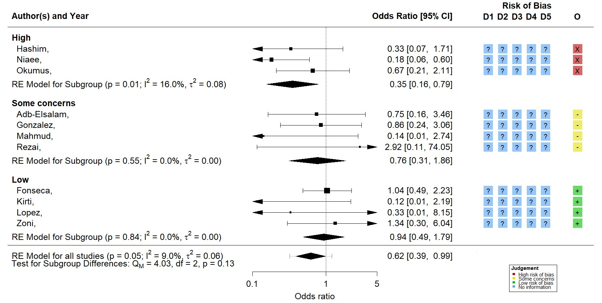
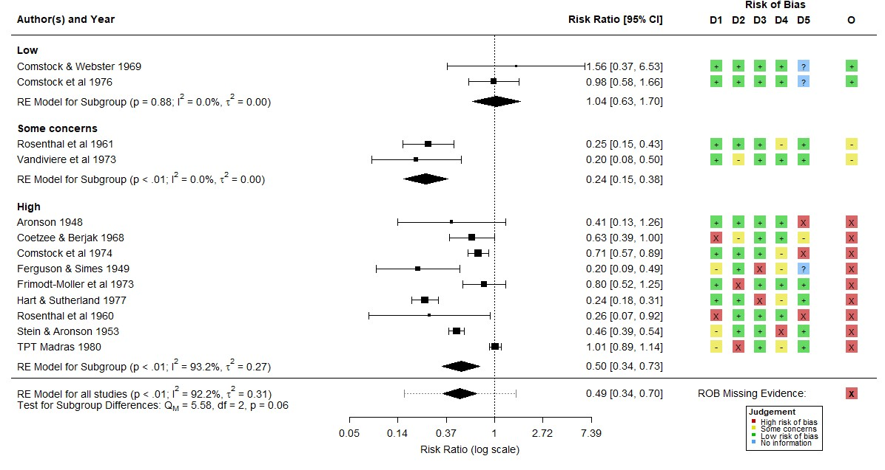
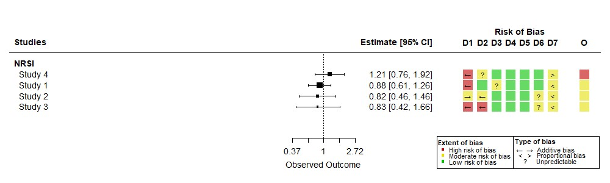

---
output:
  xaringan::moon_reader:
    css: [default, hygge, custom.css]
    lib_dir: libs
    nature:
      beforeInit: "cols_macro.js"
      highlightStyle: github
      ratio: '16:9'
      highlightSpans: true
      highlightLines: true
      countIncrementalSlides: false
      slideNumberFormat: |
        <div class="progress-bar-container">
          <div class="progress-bar" style="width: calc(%current% / %total% * 100%);">
          </div>
        </div>
---

```{r setup, include=FALSE}
options(htmltools.dir.version = FALSE)
knitr::opts_chunk$set(include = FALSE)
```

``` {r, echo = FALSE, message = FALSE}
htmltools::includeCSS("https://raw.githubusercontent.com/malcolmbarrett/kakashi/master/kakashi.css")
library(metafor)
library(robvis)
cache <- TRUE
library(dplyr)
xaringanExtra::use_xaringan_extra(c("tile_view", "webcam","scribble"))

table <- function(dat, fontsize="11pt", rows = nrow(dat)){
DT::datatable(
  dat,
  fillContainer = FALSE,
  
   options = list(pageLength = rows,
  headerCallback = DT::JS(
    "function(thead) {",
    paste0("  $(thead).css('font-size', '",fontsize,"');"),
    "}"
  ),
  dom = 't',
  columnDefs = list(list(className = 'dt-center', targets = "_all"))
),
    
  rownames = FALSE) %>%
  DT::formatStyle(
  columns = colnames(dat),
  fontSize = fontsize
)
}

```

.col-right2[
.center[

]
]

## Visualising risk-of-bias assessments in systematic reviews: an introduction to the open-source `robvis` tool

<br>

__Luke McGuinness__<br>

.small[
.image-smallest[] Honorary Senior Research Associate, 
  University of Bristol Medical School

.image-smallest[] mcguinlu

.image-smallest[] mcguinlu
]

???

Hello, I'm Luke McGuinness, a PhD student at the University of Bristol Medical School

I'm going to talk today about incorporating the resuls of risk-of-bias assessments int

Acknowledge amazing collaborators, Alex Fowler and Randall Boyes

---

class: inverse, center, middle

# Chapter 1:
# The (Original) Problem

---

## Risk-of-bias assessments

Important part of __evidence synthesis__ process

--

Different __tools__ for different __study designs__, e.g.:

.small[

* __ROB2__ - randomised controlled trials

* __ROBINS-I/E__ - non-randomised studies of interventions/exposures

]

--

Assessments are __result__ rather than __study__ specific

--

Judgements in __several sub-domains__ informs the __overall level__

---

## Example risk of bias dataset for ROB2

```{r, include = TRUE, echo = FALSE }
set.seed(5)
table(rob_dummy(9), "17pt")
```

???

Domains:
(1) bias arising from the randomization process;
(2) bias due to deviations from intended interventions;
(3) bias due to missing outcome data;
(4) bias in measurement of the outcome;
(5) bias in selection of the reported result.

---

## Making ROB figures was (is?) a pain

No __readily available__ way to create risk-of-bias figures


--

Proprietary tools (__RevMan__) limited to certain reviews (__Cochrane__)

???

RevMan not open source

--

Process (PPT, Adobe, etc) was __time-consuming__ and __error-prone__

???

Hours clicking and dragging

--

<br>

.center[

.larger[

**Q: Can I make this process any easier?**

]

]

---

class: inverse, center, middle

# Chapter 2:
# Development & Demo

---

.pull-left[

## In the beginning...

<br>
* Collection of local non-reproducible R scripts
<br>

* **UNTIL...** Evidence Synthesis Hackathon 2019, Canberra, Australia

]

.pull-right[
.middle[
.center[


]]]


---

## `robvis` 

During __ESH__, the `robvis` __R package__ was born

--

Aim -  to create __publication-quality__ risk-of-bias visualisations

--

A __web app__ was added later to __maximise potential users__

--

Initially could produce __two types of plots:__
* Traffic-light plots
* Summary barplots

???

risk of bias assessment a key part of the systematic review process

Familiar to anyone who has done a systematic review before.

robvis built to make these data more visually appealing

---

class: larger

```{r, include = TRUE, eval = FALSE}
robvis::data_rob2 # ROB2 example dataset included in robvis
```

--

```{r, include = TRUE, echo = FALSE }
table(data_rob2, "17pt")
```

---

class: center

## Traffic-light plots

.image-small[]

???

Example presented is of RoB2 tool for RCT

Studies along the right hand side, domains of bias along the left

---
class: center
##  Summary bar-plots 

<br>



???

Same data as before just presented as a bar chart instead

Can be weighted so that the proportion of information rather than the proportion of studies at each risk of bias level is shown.

---

class: center, middle

## [**Demo**](https://mcguinlu.shinyapps.io/robvis/)

???

Just to illustrate how easy it is to use

---

class: inverse, center, middle

# Chapter 3:
# Reception

---

## Reception

Paper published in 2019:

.small[
> _Luke A McGuinness and Julian PT Higgins (2020). Risk-of-bias VISualization (robvis): An R package and Shiny web app for visualizing risk-of-bias assessments Research Synthesis Methods. https://doi.org/10.1002/jrsm.1411_
]

--

Since then:

* .small[Citations: >750]

--

* .small[Downloads: >500/month]

--

* .small[Emails asking for help: >15/month]

---
class: center

## >30k visitors to the `robvis` web app
.middle[

]

???

>30000 visitors over 3 years

---

class: center


## `robvis` was much more successful than expected!

--


???

So on the basis that I now have an 

Essential question: what else can or should robvis be able to do?

---

class: inverse, center, middle

# Chapter 4:
# The (New) Problem(s)

---

class: large

##  Limitations of the current approach 

.pull-left[
.small[
Risk-of-bias assessments are performed __BUT__ data is relegated to the supplementary material

Better to try and __pair__ the assessments to their respective results

Also useful to perform __sub-group meta-analysis__ by risk-of-bias level
]
]

.pull-right[


]

???

Insufficient to simply perform the assessments, create the figure and not actively think about what this means for your meta-analysis

---
class: center, middle

.left-column[
__Problem illustrated by meta-epidemiology studies (reviews of reviews)__

__Not all reviews make use of ROB data in synthesis__
]


<br>
<br>


.footer[https://doi.org/10.1136/jech-2014-204711, https://doi.org/10.1136/bmjnph-2021-000248]

---

class: Largest

## New problems

How can **robvis** help to:

1. ... **incorporate ROB assessments** into synthesis?

--

1. ... highlight **meta-biases**?

--

<br>

.small[
__Note -__ currently only available via development version:

```{r, include =TRUE, eval=FALSE}
devtools::install_github("mcguinlu/robvis")

```
]
---

class: inverse, center, middle

# Chapter 5:
# New functionality

---

class: middle

##  Dummy data

Generate _realistic_ example risk-of-bias assessments

???

---

## Dummy data

Need for __"realistic"__ example risk-of-bias assessment datasets

???

One thing I never expected was that robvis would now be used in teaching

As such, there is a need to be able to general

Each judgement within the has a different expected frequency

--

```{r, include = TRUE, eval = FALSE, echo = TRUE}
data_rob2[5,] # 5th study in the ROB2 example dataset
```

``` {r, include = TRUE, echo = FALSE}
table(data_rob2[5,],"13pt")
```

--

```{r, include = TRUE, eval = FALSE, echo = TRUE}
rob_dummy(3) # Three randomly generated assessments for ROB2, with appropriate 'Overall' values
```

```{r include = TRUE, echo = FALSE}
set.seed(5)

table(rob_dummy(3),"13pt")
```

???

rob_dummy() also takes a `tool` argument, so that you can generate assessments for multiple different ROB tools

---

class: middle

## Paired forest plots

Integrate metafor + robvis to produce _paired_ forest/risk-of-bias plots

???

Going to walk you though an example of producing these paired using metafor, and robvis

---

## Paired forest plots

Create "paired" dataset:

```{r}
# Calculate the effect size and sampling variance for each study
dat <- metafor::escalc(
    measure = "RR",
    ai = tpos, bi = tneg, ci = cpos, di = cneg,
    data = dat.bcg,
    slab = paste(author, year))

set.seed(5)
dat <- cbind(dat,
             rob_dummy(13,study = F))

dat <- dat %>% select(author, year, yi,vi,matches("D."),Overall)

```

```{r, include=TRUE,echo=FALSE}
head(dat,2) %>%
    mutate(vi = round(vi,2),
         yi = round(yi,2)) %>% 
table(fontsize = "16pt")

```

???

Example dataset that uses:
  metadat::dat.bcg
  rob_dummy
  
Only showing the first two rows here for illustration purposes, but there are 13 results in total

--

<br>
Perform straightforward RE meta-analysis using `metafor`:

```{r meta-analysis, include = TRUE}
res <- metafor::rma(yi, # Effect sizes
                    vi, # Sampling variances
                    data = dat, # Dataset
                    slab = paste(author,year)) # Study label

```


???

So we use the escalc function to generate our study effect sizes and sampling variances from the raw counts

This data is then passed to a simple random effects meta-analytical model, and the results are stored in the `res` object.

---

## Paired forest plots

```{r, include = TRUE, message=FALSE, fig.align="center", fig.width=9, fig.height=6}
metafor::forest(res)
```

???

Once we have the results of our meta-analysis

And this is the standard approach.

I'm now going to walk you through two ways in which robvis can add to this standard approach.

---

## Paired forest plots

`rob_forest()`

* Drop-in replacement for **metafor::forest()**

* Maintains pairing between __result__ and __bias assessment__

* Allows for subgroup analysis by __overall risk-of-bias level__

---

```{r, include = FALSE, echo = TRUE, warning= FALSE,message=FALSE, fig.align="center", fig.width=9, fig.height=6}
png("figures/rob_forest.png",width = 1200, height = 700)
rob_forest(res)
dev.off()
```

```{r, include = TRUE, eval = FALSE}
rob_forest(res)
```




???

This function acts as a wrapper to the metafor::forest function and appends a risk of bias plot to the right hand side

This is only possible due to the foresight of the metafor package developer, who ensured that the forest function could be built upon.

Takes whatever meta-analytical model you have specified (though limited to metafor for now) and applies it across studies grouped by risk of bias level.

Presents test of difference between the different 


---

## Case study: Ivermectin for COVID-19

Study of 12 trials of __Ivermectin__ for treatment of __COVID-19__

--

__Protective overall effect__ - OR: 0.62 (95%CI: 0.39-0.99)

--

Re-analysis performed ROB assessments of included trials:

* 4 at Low
* 4 at Some concerns
* 3 at High
* 1 at critical (excluded)

.footer[https://www.researchsquare.com/article/rs-1003006/v1]

???

Re-analysis by Hill, Mirchandani, and Pilkington 

---

## Case study: Ivermectin for COVID-19



??? 

1 study excluded as critical risk of bias

No domain-level information

In summary, risk-of-bias assesments should be presented alongside their corresponding numerical result in forest plots, as it allows you to easily assess the underlying validity of information going into the meta-analysis.

---

## Risk of bias due to missing evidence (ROB-ME)

New tool to assess bias at the level of the synthesis:
.small[

* Known unknowns: results we know are missing

* Unknown unknowns: results we have no idea exist

]

`robvis` allows for the result of this assessment to be included in the plot

.footer[https://www.riskofbias.info/welcome/rob-me-tool]

---

```{r, include = FALSE, echo = TRUE, warning= FALSE,message=FALSE, fig.align="center", fig.width=9, fig.height=6}
png("figures/rob_forest_me.png",width = 1200,height = 700)
rob_forest(res, rob_me = "High")
dev.off()
```

```{r, include = TRUE, eval= FALSE}
rob_forest(res, rob_me = "High")
```



---

class: inverse, center, middle

# Chapter 6:
# To summarise...

---

##  Take-home messages 

* Risk-of-bias assessments should be __presented alongside the corresponding result__

* Risk-of-bias level should be investigated as a __source of heterogeneity__

* Readers should be made aware of the risk of __meta-bias__ in an analysis

* New functionality in `robvis` __can help__ with this!

---

## Where to next? Bias direction plots!

Optional question at end of each domain- e.g. D1 of ROBINS-I:
.small[
> What is the predicted direction of
bias due to confounding?

>Favours experimental /Favours comparator/ Unpredictable
]



---

class: larger

##  Further info 

__See docs/info at:__
* Package website: [mcguinlu.github.io/robvis/](https://mcguinlu.github.io/robvis)
* Shiny app: [mcguinlu.shinyapps.io/robvis/](https://mcguinlu.shinyapps.io/robvis/)
	
__Paper introducing `robvis`:__
* McGuinness, L. A., & Higgins, J. P. (2020). Risk-of-bias VISualization (robvis): An R package and Shiny web app for visualizing risk-of-bias assessments. Research Synthesis Methods .

__Contribute to the package__:
* Open an issue on the GitHub repository
* Tweet at me ([@mcguinlu](https://twitter.com/mcguinlu))
* Send me an email (luke.a.mcguinness\[at\]gmail.com)

<br>

.center[__Thanks to `robvis` contributors Randall Boyes and Alex Fowler for all their support!__]
